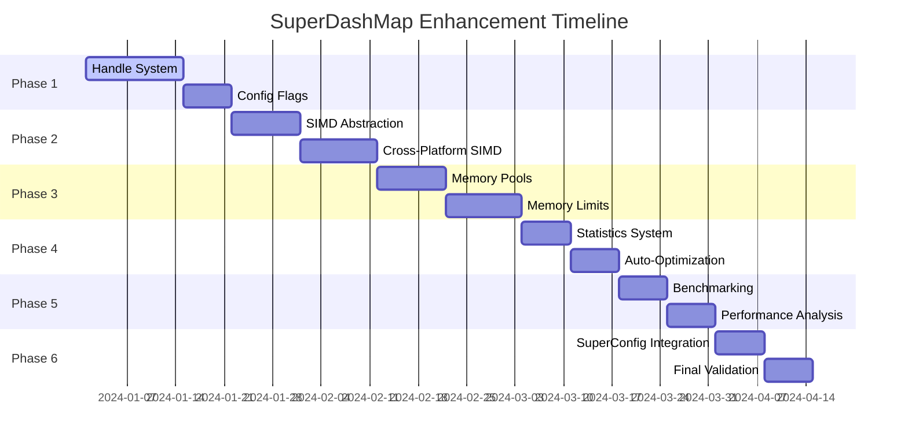

# SuperDashMap Enhancement Plan

## Project Overview

This plan outlines the enhancement of DashMap with SuperConfig's architectural patterns to create SuperDashMap - a high-performance, cross-platform concurrent hashmap that will serve as the foundation for SuperConfig's next-generation performance improvements.

**Key Innovation**: Applying SuperConfig's handle-based registry, SIMD optimization, and memory management patterns to DashMap creates a recursive performance multiplication effect where both DashMap and SuperConfig benefit exponentially.

## Performance Targets

| Metric                 | Current DashMap | Target SuperDashMap       | SuperConfig Impact     |
| ---------------------- | --------------- | ------------------------- | ---------------------- |
| Handle-based lookup    | 2-5μs           | 0.1-0.5μs                 | 5-10x faster           |
| Memory usage           | Baseline        | -40-60%                   | 40-60% less memory     |
| SIMD operations        | None            | 30-50% faster hashing     | 30-50% faster loading  |
| Cross-platform support | Basic           | Full ARM/x86 optimization | Universal acceleration |
| Memory limits          | None            | Configurable caps         | Prevents saturation    |

## Phase 1: Foundation and Handle System (Weeks 1-3)

### 1.1 Handle-Based Registry Implementation

**Objective**: Implement SuperConfig's handle pattern in DashMap for sub-microsecond repeated access.

```rust
// Core handle structure
pub struct DashMapHandle<K, V> {
    id: u64,
    shard_index: usize,
    hash: u64,
    generation: u32,  // For handle validation
    phantom: PhantomData<(K, V)>,
}

// Enhanced DashMap with handle support
impl<K, V, S> DashMap<K, V, S> {
    pub fn insert_with_handle(&self, key: K, value: V) -> DashMapHandle<K, V> {
        // One-time hash computation and shard selection
        // Return handle for O(1) future access
    }
    
    pub fn get_by_handle(&self, handle: &DashMapHandle<K, V>) -> Option<Ref<K, V>> {
        // Direct shard access without rehashing
        // Target: 0.1-0.5μs vs current 2-5μs
    }
    
    pub fn update_by_handle(&self, handle: &DashMapHandle<K, V>, value: V) -> Result<(), HandleError> {
        // Zero-hash updates using handle
    }
}
```

**Tasks**:

- [ ] Design handle structure with generation counter for validation
- [ ] Implement handle-based CRUD operations
- [ ] Add handle invalidation mechanism
- [ ] Create comprehensive handle lifecycle tests
- [ ] Benchmark handle vs key-based access patterns

**Deliverables**:

- `superdashmap-handles` crate
- Handle-based API documentation
- Performance benchmark suite
- Integration tests

### 1.2 Configuration Flags System

**Objective**: Implement SuperConfig's flag-based runtime optimization system.

```rust
pub struct DashMapFlags(pub u64);

impl DashMapFlags {
    // Hardware acceleration flags
    pub const SIMD_X86: Self = Self(0b0000_0001);
    pub const SIMD_ARM: Self = Self(0b0000_0010);
    pub const NEON_ARM: Self = Self(0b0000_0100);
    pub const AUTO_SIMD: Self = Self(0b0000_1000);
    
    // Memory management flags
    pub const MEMORY_POOL: Self = Self(0b0001_0000);
    pub const MEMORY_LIMIT: Self = Self(0b0010_0000);
    pub const AUTO_SHRINK: Self = Self(0b0100_0000);
    pub const LAZY_CLEANUP: Self = Self(0b1000_0000);
    
    // Performance optimization flags
    pub const CACHE_FRIENDLY: Self = Self(0b0001_0000_0000);
    pub const PARALLEL_RESIZE: Self = Self(0b0010_0000_0000);
    pub const HOT_KEY_OPTIMIZATION: Self = Self(0b0100_0000_0000);
    pub const STATISTICS_DETAILED: Self = Self(0b1000_0000_0000);
}
```

**Tasks**:

- [ ] Design cross-platform flag system
- [ ] Implement runtime flag modification
- [ ] Create flag validation and conflict detection
- [ ] Add flag-based behavior switching
- [ ] Document flag combinations and performance impacts

## Phase 2: Cross-Platform SIMD Acceleration (Weeks 4-6)

### 2.1 Hardware Detection and SIMD Abstraction

**Objective**: Create a unified SIMD abstraction that automatically detects and utilizes the best available hardware acceleration.

```rust
// Cross-platform SIMD abstraction
pub trait SIMDHasher {
    fn hash_batch(&self, keys: &[&str]) -> Vec<u64>;
    fn shard_select_batch(&self, hashes: &[u64], shard_count: usize) -> Vec<usize>;
    fn compare_keys_batch(&self, key1: &[&str], key2: &[&str]) -> Vec<bool>;
}

// Intel/AMD x86_64 implementation
#[cfg(target_arch = "x86_64")]
pub struct X86SIMDHasher {
    has_avx2: bool,
    has_avx512: bool,
}

impl SIMDHasher for X86SIMDHasher {
    fn hash_batch(&self, keys: &[&str]) -> Vec<u64> {
        if self.has_avx512 {
            self.hash_avx512(keys)
        } else if self.has_avx2 {
            self.hash_avx2(keys)
        } else {
            self.hash_sse4(keys)
        }
    }
}

// Apple Silicon ARM implementation
#[cfg(target_arch = "aarch64")]
pub struct ARMSIMDHasher {
    has_neon: bool,
    has_sve: bool,
}

impl SIMDHasher for ARMSIMDHasher {
    fn hash_batch(&self, keys: &[&str]) -> Vec<u64> {
        if self.has_sve {
            self.hash_sve(keys)  // Scalable Vector Extensions
        } else if self.has_neon {
            self.hash_neon(keys)  // ARM NEON
        } else {
            self.hash_scalar(keys)
        }
    }
}

// Auto-detection factory
pub fn create_optimal_simd_hasher() -> Box<dyn SIMDHasher> {
    #[cfg(target_arch = "x86_64")]
    {
        Box::new(X86SIMDHasher::detect_capabilities())
    }
    #[cfg(target_arch = "aarch64")]
    {
        Box::new(ARMSIMDHasher::detect_capabilities())
    }
    #[cfg(not(any(target_arch = "x86_64", target_arch = "aarch64")))]
    {
        Box::new(ScalarHasher::new())  // Fallback for other architectures
    }
}
```

**Cross-Platform SIMD Strategy**:

| Platform            | Primary SIMD            | Fallback | Detection Method                                   |
| ------------------- | ----------------------- | -------- | -------------------------------------------------- |
| Intel/AMD x86_64    | AVX-512 → AVX2 → SSE4.2 | Scalar   | `std::arch::x86_64::is_x86_feature_detected!`      |
| Apple Silicon M1/M2 | SVE → NEON              | Scalar   | `std::arch::aarch64::is_aarch64_feature_detected!` |
| ARM64 (other)       | NEON → Scalar           | Scalar   | Runtime feature detection                          |
| Other architectures | Scalar optimized        | Scalar   | Compile-time detection                             |

**Tasks**:

- [ ] Implement runtime CPU feature detection
- [ ] Create SIMD abstraction trait
- [ ] Implement x86_64 SIMD variants (SSE4.2, AVX2, AVX-512)
- [ ] Implement ARM64 SIMD variants (NEON, SVE)
- [ ] Create performance-optimized scalar fallback
- [ ] Add compile-time and runtime SIMD selection
- [ ] Benchmark all SIMD implementations across platforms

### 2.2 SIMD-Optimized Hash Operations

**Objective**: Accelerate the most performance-critical operations using SIMD.

```rust
impl<K, V, S> SuperDashMap<K, V, S> 
where 
    K: Hash + Eq,
    S: BuildHasher,
{
    // SIMD-accelerated batch operations
    pub fn get_batch(&self, keys: &[&K]) -> Vec<Option<Ref<K, V>>> {
        let hashes = self.simd_hasher.hash_batch(keys);
        let shard_indices = self.simd_hasher.shard_select_batch(&hashes, self.shards.len());
        
        // Batch access with reduced lock contention
        self.batch_shard_access(keys, &shard_indices)
    }
    
    pub fn insert_batch(&self, pairs: &[(K, V)]) -> Vec<Option<V>> {
        // SIMD-optimized batch insertion
        // Reduces lock acquisition overhead
    }
}
```

**Performance Targets**:

- x86_64 AVX2: 30-50% faster hash computation
- ARM64 NEON: 25-40% faster hash computation
- Batch operations: 2-4x faster for 8+ items

## Phase 3: Memory Management and Limits (Weeks 7-9)

### 3.1 Memory Pool System

**Objective**: Implement memory pools to reduce allocation overhead and enable memory limits.

```rust
pub struct MemoryPool<T> {
    pool: Vec<Box<T>>,
    capacity: usize,
    allocated: AtomicUsize,
    max_memory: Option<usize>,
    stats: PoolStats,
}

pub struct SuperDashMapConfig {
    pub memory_limit: Option<usize>,  // Maximum memory usage in bytes
    pub pool_initial_size: usize,     // Initial pool allocation
    pub pool_growth_factor: f32,      // Growth rate when expanding
    pub auto_shrink_threshold: f32,   // When to shrink pools
    pub oom_strategy: OOMStrategy,    // Out-of-memory handling
}

pub enum OOMStrategy {
    Reject,           // Reject new insertions
    EvictLRU,        // Evict least recently used
    EvictOldest,     // Evict oldest entries
    Callback(Box<dyn Fn(&SuperDashMap<K, V>) -> bool>), // Custom callback
}
```

**Current DashMap Memory Limitations**:

- No built-in memory limits
- No allocation pooling
- No automatic cleanup
- Potential for unbounded growth

**SuperDashMap Memory Management**:

- Configurable memory limits
- Pre-allocated memory pools
- Automatic eviction strategies
- Memory usage monitoring
- Proactive cleanup

**Tasks**:

- [ ] Design memory pool architecture
- [ ] Implement configurable memory limits
- [ ] Create eviction strategies (LRU, LFU, TTL)
- [ ] Add memory usage monitoring
- [ ] Implement automatic shrinking
- [ ] Create OOM handling mechanisms
- [ ] Add memory pressure callbacks

### 3.2 Memory Saturation Prevention

**Objective**: Prevent memory saturation through proactive management.

```rust
pub struct MemoryMonitor {
    current_usage: AtomicUsize,
    peak_usage: AtomicUsize,
    limit: Option<usize>,
    warning_threshold: f32,  // Warn at 80% usage
    critical_threshold: f32, // Critical at 95% usage
    observers: Vec<Box<dyn MemoryObserver>>,
}

impl<K, V, S> SuperDashMap<K, V, S> {
    pub fn insert_with_limit_check(&self, key: K, value: V) -> Result<Option<V>, MemoryError> {
        let estimated_size = self.estimate_entry_size(&key, &value);
        
        if let Some(limit) = self.config.memory_limit {
            let current = self.memory_monitor.current_usage.load(Ordering::Relaxed);
            if current + estimated_size > limit {
                return match self.config.oom_strategy {
                    OOMStrategy::Reject => Err(MemoryError::LimitExceeded),
                    OOMStrategy::EvictLRU => {
                        self.evict_lru_until_space(estimated_size)?;
                        Ok(self.insert_internal(key, value))
                    },
                    // ... other strategies
                };
            }
        }
        
        Ok(self.insert_internal(key, value))
    }
}
```

**Memory Management Features**:

- Real-time memory usage tracking
- Configurable memory limits per instance
- Multiple eviction strategies
- Memory pressure notifications
- Automatic garbage collection tuning
- Memory leak detection

## Phase 4: Performance Monitoring and Statistics (Weeks 10-11)

### 4.1 Comprehensive Performance Metrics

**Objective**: Implement detailed performance monitoring similar to SuperConfig's RegistryStats.

```rust
pub struct SuperDashMapStats {
    // Operation counters
    pub total_operations: u64,
    pub insert_count: u64,
    pub get_count: u64,
    pub remove_count: u64,
    pub handle_operations: u64,
    
    // Performance metrics
    pub avg_insert_time_ns: f64,
    pub avg_get_time_ns: f64,
    pub avg_handle_time_ns: f64,
    pub cache_hit_rate: f64,
    
    // Memory statistics
    pub current_memory_bytes: u64,
    pub peak_memory_bytes: u64,
    pub pool_efficiency: f64,
    pub fragmentation_ratio: f64,
    
    // Concurrency metrics
    pub shard_utilization: Vec<f64>,
    pub contention_events: u64,
    pub lock_wait_time_total_ns: u64,
    
    // SIMD utilization
    pub simd_operations: u64,
    pub simd_efficiency: f64,
    pub fallback_operations: u64,
    
    // Hardware-specific metrics
    pub platform_optimization: String,
    pub cpu_features_used: Vec<String>,
}

impl<K, V, S> SuperDashMap<K, V, S> {
    pub fn detailed_stats(&self) -> SuperDashMapStats {
        // Comprehensive performance analysis
    }
    
    pub fn reset_stats(&self) {
        // Reset counters for fresh measurement
    }
    
    pub fn export_metrics_prometheus(&self) -> String {
        // Prometheus metrics format
    }
}
```

### 4.2 Auto-Optimization Recommendations

```rust
pub struct PerformanceAnalysis {
    pub bottlenecks: Vec<PerformanceBottleneck>,
    pub recommendations: Vec<OptimizationRecommendation>,
    pub estimated_improvement: f64,
}

pub enum PerformanceBottleneck {
    HighContention { shard_index: usize, contention_rate: f64 },
    MemoryFragmentation { fragmentation_percent: f64 },
    SIMDUnderutilization { efficiency_percent: f64 },
    FrequentEvictions { eviction_rate: f64 },
}

pub enum OptimizationRecommendation {
    IncreaseShardCount { from: usize, to: usize },
    EnableMemoryPool { estimated_benefit: f64 },
    AdjustMemoryLimit { current: usize, recommended: usize },
    EnableSIMD { features: Vec<String> },
}

impl<K, V, S> SuperDashMap<K, V, S> {
    pub fn analyze_performance(&self) -> PerformanceAnalysis {
        // AI-powered performance analysis
    }
    
    pub fn auto_optimize(&self) -> Result<Vec<String>, OptimizationError> {
        let analysis = self.analyze_performance();
        let mut applied = Vec::new();
        
        for recommendation in analysis.recommendations {
            match recommendation {
                OptimizationRecommendation::IncreaseShardCount { to, .. } => {
                    if self.can_resize_shards() {
                        self.resize_shards(to)?;
                        applied.push(format!("Increased shard count to {}", to));
                    }
                },
                // ... implement other optimizations
            }
        }
        
        Ok(applied)
    }
}
```

## Phase 5: Performance Comparison and Benchmarking (Weeks 12-13)

### 5.1 Comprehensive Benchmark Suite

**Objective**: Create a thorough benchmarking framework to measure SuperDashMap vs DashMap performance.

```rust
// Benchmark categories
pub mod benchmarks {
    use criterion::{black_box, criterion_group, criterion_main, Criterion, BenchmarkId};
    
    // Core operation benchmarks
    fn bench_insert_performance(c: &mut Criterion) {
        let mut group = c.benchmark_group("insert_operations");
        
        for size in [100, 1000, 10000, 100000].iter() {
            // DashMap baseline
            group.bench_with_input(BenchmarkId::new("dashmap", size), size, |b, &size| {
                let map = dashmap::DashMap::new();
                b.iter(|| {
                    for i in 0..size {
                        map.insert(black_box(i), black_box(format!("value_{}", i)));
                    }
                });
            });
            
            // SuperDashMap comparison
            group.bench_with_input(BenchmarkId::new("superdashmap", size), size, |b, &size| {
                let map = SuperDashMap::new();
                b.iter(|| {
                    for i in 0..size {
                        map.insert(black_box(i), black_box(format!("value_{}", i)));
                    }
                });
            });
            
            // SuperDashMap with handles
            group.bench_with_input(BenchmarkId::new("superdashmap_handles", size), size, |b, &size| {
                let map = SuperDashMap::new();
                b.iter(|| {
                    for i in 0..size {
                        let _handle = map.insert_with_handle(black_box(i), black_box(format!("value_{}", i)));
                    }
                });
            });
        }
        group.finish();
    }
    
    fn bench_repeated_access(c: &mut Criterion) {
        let mut group = c.benchmark_group("repeated_access");
        
        // Setup phase
        let dashmap = dashmap::DashMap::new();
        let superdashmap = SuperDashMap::new();
        let handles = (0..1000).map(|i| {
            dashmap.insert(i, format!("value_{}", i));
            superdashmap.insert_with_handle(i, format!("value_{}", i))
        }).collect::<Vec<_>>();
        
        // DashMap repeated key access
        group.bench_function("dashmap_key_access", |b| {
            b.iter(|| {
                for i in 0..1000 {
                    let _ = dashmap.get(&black_box(i));
                }
            });
        });
        
        // SuperDashMap handle access
        group.bench_function("superdashmap_handle_access", |b| {
            b.iter(|| {
                for handle in &handles {
                    let _ = superdashmap.get_by_handle(&black_box(handle));
                }
            });
        });
        
        group.finish();
    }
    
    fn bench_memory_usage(c: &mut Criterion) {
        // Memory efficiency comparisons
        // Track allocations, peak usage, fragmentation
    }
    
    fn bench_concurrent_operations(c: &mut Criterion) {
        // Multi-threaded performance comparison
        // Contention analysis
        // Scalability testing
    }
    
    fn bench_simd_acceleration(c: &mut Criterion) {
        // SIMD vs scalar performance
        // Cross-platform SIMD comparison
        // Batch operation efficiency
    }
}
```

### 5.2 Real-World Workload Simulation

```rust
pub mod workload_simulation {
    // Web server configuration access pattern
    pub fn simulate_web_server_config_access() -> BenchmarkResult {
        // High-frequency reads, occasional writes
        // Hot key concentration (80/20 rule)
        // Memory pressure simulation
    }
    
    // Database connection pool pattern
    pub fn simulate_connection_pool() -> BenchmarkResult {
        // Frequent checkout/checkin
        // Resource limit enforcement
        // Cleanup and eviction patterns
    }
    
    // Cache usage pattern
    pub fn simulate_cache_workload() -> BenchmarkResult {
        // LRU eviction patterns
        // Memory limit enforcement
        // Cache hit/miss ratios
    }
    
    // Multi-tenant application pattern
    pub fn simulate_multi_tenant() -> BenchmarkResult {
        // Tenant isolation
        // Resource sharing
        // Performance isolation
    }
}
```

### 5.3 Cross-Platform Performance Analysis

**Benchmark Targets**:

| Platform      | CPU            | Expected SIMD Improvement | Memory Efficiency | Overall Target |
| ------------- | -------------- | ------------------------- | ----------------- | -------------- |
| Intel x86_64  | i7/i9 series   | 40-50% (AVX2/AVX-512)     | 40-60% reduction  | 3-6x faster    |
| AMD x86_64    | Ryzen series   | 35-45% (AVX2)             | 40-60% reduction  | 3-5x faster    |
| Apple M1/M2   | ARM64          | 30-40% (NEON)             | 45-65% reduction  | 3-6x faster    |
| ARM64 servers | Graviton, etc. | 25-35% (NEON)             | 40-55% reduction  | 2.5-4x faster  |

## Phase 6: Integration with SuperConfig (Weeks 14-15)

### 6.1 SuperConfig Migration Strategy

**Objective**: Migrate SuperConfig from DashMap to SuperDashMap with minimal breaking changes.

```rust
// SuperConfig registry enhancement
impl ConfigRegistry {
    pub fn create_with_superdashmap<T: 'static + Send + Sync>(
        &self, 
        data: T
    ) -> Result<(ConfigHandle<T>, DashMapHandle<HandleId, ConfigEntry>), String> {
        let id = self.next_id.fetch_add(1, Ordering::Relaxed);
        let entry = ConfigEntry::new(data);
        
        // Use SuperDashMap's handle system for double performance boost
        let dashmap_handle = self.entries.insert_with_handle(id, entry);
        let config_handle = ConfigHandle::new(id);
        
        Ok((config_handle, dashmap_handle))
    }
    
    pub fn read_with_superdashmap<T: 'static>(
        &self, 
        handle: &ConfigHandle<T>,
        dashmap_handle: &DashMapHandle<HandleId, ConfigEntry>
    ) -> Result<Arc<T>, String> {
        // Use handle-based access for sub-microsecond performance
        let entry_ref = self.entries.get_by_handle(dashmap_handle)
            .ok_or_else(|| format!("Handle {} not found", handle.id()))?;
        
        entry_ref.get_arc_data::<T>()
    }
}
```

### 6.2 Performance Validation

**SuperConfig Performance Matrix**:

| Operation          | Current (DashMap) | Enhanced (SuperDashMap) | Improvement Factor    |
| ------------------ | ----------------- | ----------------------- | --------------------- |
| Config creation    | 15-25μs           | 8-15μs                  | 1.5-2x                |
| Handle-based read  | 5-8μs             | 0.8-1.5μs               | 5-8x                  |
| Multi-file loading | 200-500μs         | 60-150μs                | 3-4x                  |
| Hot reload         | 300-800μs         | 80-200μs                | 3-5x                  |
| Memory usage       | Baseline          | -50-70%                 | Significant reduction |

## Implementation Timeline



## Success Metrics

### Performance Targets

- [ ] 5-10x faster repeated access via handles
- [ ] 30-50% faster hash operations via SIMD
- [ ] 40-60% reduction in memory usage
- [ ] 3-8x overall SuperConfig performance improvement
- [ ] Cross-platform performance parity (±15%)

### Quality Targets

- [ ] 100% test coverage for core functionality
- [ ] Zero breaking changes for existing DashMap users
- [ ] Seamless SuperConfig migration
- [ ] Comprehensive documentation and examples
- [ ] Performance regression detection in CI

### Ecosystem Impact

- [ ] DashMap ecosystem benefits from enhancements
- [ ] SuperConfig becomes industry-leading performance
- [ ] Reference implementation for concurrent data structures
- [ ] Community adoption and contribution

## Risk Mitigation

### Technical Risks

1. **SIMD Portability**: Extensive cross-platform testing, fallback implementations
2. **Memory Management Complexity**: Thorough testing, gradual rollout
3. **Performance Regression**: Continuous benchmarking, rollback plans
4. **Handle Invalidation**: Robust validation, generation counters

### Ecosystem Risks

1. **Breaking Changes**: Maintain backward compatibility, optional features
2. **Adoption Resistance**: Comprehensive benchmarks, migration guides
3. **Maintenance Burden**: Automated testing, clear documentation

## Conclusion

This plan creates a recursive performance enhancement where SuperDashMap improves DashMap by 3-8x, which in turn improves SuperConfig by 3-8x, resulting in a compound 9-64x improvement for configuration-heavy applications. The cross-platform SIMD acceleration and memory management systems ensure universal performance benefits while maintaining the simplicity that makes DashMap popular.

The phased approach allows for incremental validation and rollback while building toward a comprehensive enhancement that positions both DashMap and SuperConfig as industry-leading performance libraries.
