# LogFusion Documentation Strategy

## Overview

This document outlines the unified documentation strategy for LogFusion, driving all users to a single, beautiful documentation website while maintaining minimal presence on other platforms.

## Core Philosophy: Website as Single Source of Truth

Instead of maintaining documentation across multiple platforms (docs.rs, GitHub, website), we funnel all users to **logfusion.deepbrain.ai** - our Next.js + Fumadocs powered documentation site.

## Documentation Architecture

### 1. **Discovery Points (Minimal Documentation)**

All discovery points serve as teasers that direct users to the main website:

#### **Crates.io**

- Shows README.md with brief intro
- Quick example (5-10 lines)
- Prominent link to website

#### **docs.rs**

- Minimal rustdoc with API reference
- One simple quick start example
- Clear CTAs to visit website for full docs

#### **GitHub**

- README.md as teaser
- Link to website in repo description
- Documentation badge linking to website

### 2. **Main Documentation Site (logfusion.deepbrain.ai)**

The website is the ONLY place with complete documentation:

```
logfusion.deepbrain.ai/
├── Home                         # Landing page with value props
├── Quick Start                  # Get running in 2 minutes
├── Core Concepts               # Key ideas and philosophy
├── Cookbook/                    # From crates/logfusion/cookbook/*.md
│   ├── Basic Logging
│   ├── Structured Logging
│   ├── Error Handling
│   ├── Spans & Instrumentation
│   ├── Advanced Tracing
│   ├── FFI Integration
│   ├── Error Monitoring
│   └── Debugging Workflows
├── Examples/                    # From crates/logfusion/examples/*.rs
│   ├── Interactive Playground   # Try code live
│   ├── Structured Logging Demo
│   ├── Error Format Showcase
│   └── ... (all 11 examples)
├── API Reference               # Generated from rustdoc JSON
├── Integration Guides/
│   ├── Python (PyO3)
│   ├── Node.js (Neon)
│   ├── WebAssembly
│   └── C/C++ FFI
├── Video Tutorials             # Embedded videos
├── Migration Guide             # From log/env_logger
└── Version Selector            # Docs for each version
```

## Implementation Details

### Minimal Rustdoc (src/lib.rs)

````rust
//! # LogFusion - Enhanced Logging Bridge for Rust
//!
//! Tracing-native logging with structured data and powerful error handling.
//!
//! ## Quick Start
//!
//! ```rust
//! use logfusion::{info, warn, error};
//!
//! fn main() {
//!     // Auto-initialization - no setup needed!
//!     info!(user_id = 123, action = "login", "User authenticated");
//!     error!(code = "DB_TIMEOUT", "Database connection failed");
//! }
//! ```
//!
//! ## 📚 Complete Documentation
//!
//! **Visit [logfusion.deepbrain.ai](https://logfusion.deepbrain.ai) for:**
//!
//! - ✨ **Interactive examples** with live playground
//! - 📖 **Comprehensive cookbook** with real-world patterns
//! - 🎯 **Searchable API reference** with examples
//! - 🎬 **Video tutorials** for visual learners
//! - 🔧 **Integration guides** for Python, Node.js, and more
//!
//! ---
//!
//! 🚀 **[Get Started →](https://logfusion.deepbrain.ai/quickstart)**
//!
//! 📖 **[View Cookbook →](https://logfusion.deepbrain.ai/cookbook)**
//!
//! 🎮 **[Try Interactive Examples →](https://logfusion.deepbrain.ai/playground)**
````

### Teaser README.md

````markdown
# LogFusion

Modern logging for Rust with structured data and powerful error handling.

```rust
use logfusion::{info, define_errors};

define_errors! {
    AppError {
        UserNotFound { id: u64 } : "User {id} not found"
    }
}

info!(user_id = 123, action = "login", "User authenticated");
```
````

## 📚 Documentation

**Full documentation available at [logfusion.deepbrain.ai](https://logfusion.deepbrain.ai)**

### Why Visit Our Docs?

- 🎮 **Interactive Playground** - Try examples live
- 📺 **Video Tutorials** - See LogFusion in action
- 🎨 **Beautiful Interface** - Dark mode, search, syntax highlighting
- 📱 **Mobile Friendly** - Read anywhere
- ⚡ **Fast Search** - Find what you need instantly
- 🔄 **Always Up-to-date** - Latest features documented

## Quick Install

```toml
[dependencies]
logfusion = "0.2"
```

**[Get Started →](https://logfusion.deepbrain.ai/quickstart)**

````
### Website Implementation (Next.js + Fumadocs)

```typescript
// apps/docs/src/lib/content.ts
import fs from 'fs';
import path from 'path';

const LOGFUSION_CRATE = path.join(process.cwd(), '../../../crates/logfusion');

export async function getCookbookContent() {
  const cookbookDir = path.join(LOGFUSION_CRATE, 'cookbook');
  const files = fs.readdirSync(cookbookDir);
  
  return files.map(file => ({
    slug: file.replace('.md', ''),
    content: fs.readFileSync(path.join(cookbookDir, file), 'utf-8'),
    title: extractTitle(file)
  }));
}

export async function getExamples() {
  const examplesDir = path.join(LOGFUSION_CRATE, 'examples');
  const files = fs.readdirSync(examplesDir)
    .filter(f => f.endsWith('.rs'));
  
  return files.map(file => ({
    name: file.replace('.rs', ''),
    code: fs.readFileSync(path.join(examplesDir, file), 'utf-8'),
    runnable: true // Enable playground
  }));
}
````

## Documentation Flow

```mermaid
graph LR
    A[User Discovers LogFusion] --> B{Where?}
    B -->|crates.io| C[Brief README]
    B -->|docs.rs| D[Minimal API docs]
    B -->|GitHub| E[Teaser README]
    B -->|Google| F[SEO optimized]
    
    C --> G[🌟 logfusion.deepbrain.ai]
    D --> G
    E --> G
    F --> G
    
    G --> H[Complete Documentation]
    H --> I[Interactive Examples]
    H --> J[Video Tutorials]
    H --> K[Beautiful UI]
    H --> L[Version Switcher]
```



## Benefits of Website-First Strategy

### 1. **Single Maintenance Point**

- Update documentation in one place
- No synchronization issues
- Version control in website repo

### 2. **Superior User Experience**

- Interactive code playgrounds
- Rich media (diagrams, videos)
- Better search functionality
- Dark mode support
- Copy buttons for code
- Mobile responsive

### 3. **Business Benefits**

- Full analytics on documentation usage
- Control over user journey
- Lead generation opportunities
- A/B testing capabilities
- SEO optimization

### 4. **Technical Advantages**

- Fumadocs provides MDX support
- React components for interactivity
- API route for rustdoc JSON parsing
- Static generation for speed
- Incremental static regeneration

## Marketing Strategy

### Value Propositions for Website Links

```rust
// In rustdoc
//! ## Why Our Documentation?
//!
//! 🌟 **Not your typical Rust docs!**
//!
//! - 🎮 **Try it live** - Interactive Rust playground
//! - 📺 **Learn visually** - Video guides and tutorials
//! - 🎨 **Beautiful UI** - Dark mode, search, syntax highlighting
//! - 📱 **Read anywhere** - Mobile optimized
//! - ⚡ **Find instantly** - Powerful search across all content
//!
//! Don't settle for plain text - experience documentation that helps you ship faster.
//!
//! **[Visit logfusion.deepbrain.ai →](https://logfusion.deepbrain.ai)**
```

### SEO Strategy

1. **Primary Domain**: logfusion.deepbrain.ai
2. **Keywords**: "rust logging", "structured logging rust", "tracing rust"
3. **Content**: Rich, searchable content with examples
4. **Backlinks**: From crates.io, docs.rs, GitHub
5. **Schema**: Documentation schema markup

## Implementation Checklist

- [ ] Create minimal lib.rs rustdoc with website links
- [ ] Update README.md as teaser with strong CTA
- [ ] Set up Next.js + Fumadocs site structure
- [ ] Import cookbook content into website
- [ ] Import examples with playground integration
- [ ] Generate API reference from rustdoc JSON
- [ ] Add video tutorials section
- [ ] Implement version switcher
- [ ] Set up analytics (Plausible/Vercel)
- [ ] Configure SEO and Open Graph tags
- [ ] Add search functionality (Algolia/Fumadocs)
- [ ] Create interactive playground
- [ ] Design beautiful landing page

## Content Reuse Strategy

The website reads directly from the crate files:

```typescript
// Website file structure
apps/docs/
├── src/
│   ├── app/
│   │   ├── page.tsx           // Landing
│   │   ├── quickstart/        // Getting started
│   │   ├── cookbook/          // Reads from crate/cookbook/
│   │   ├── examples/          // Reads from crate/examples/
│   │   ├── api/              // Generated from rustdoc
│   │   └── playground/        // Interactive editor
│   └── lib/
│       └── content.ts         // File reading utilities
└── content/
    └── generated/             // API docs from rustdoc JSON
```

## Metrics & Success Criteria

### Documentation Effectiveness

- Website traffic (unique visitors/month)
- Average time on documentation
- Bounce rate < 30%
- Search queries and click-through
- Playground usage statistics

### User Journey

- crates.io → website conversion rate
- docs.rs → website conversion rate
- Time to first successful integration
- Support tickets related to documentation

### Business Metrics

- Documentation as lead source
- Newsletter signups from docs
- GitHub stars correlation
- Corporate adoption tracking

## Future Enhancements

1. **AI-Powered Search** - Natural language queries
2. **Interactive Tutorials** - Step-by-step guided learning
3. **Community Examples** - User-contributed patterns
4. **Localization** - Multi-language support
5. **Offline Mode** - PWA for offline access
6. **Code Generation** - AI-assisted code writing
7. **Integration Testing** - Live API testing in browser

## Conclusion

This unified strategy ensures:

- **Single source of truth** - Website only
- **Better user experience** - Rich, interactive docs
- **Business control** - Analytics, SEO, lead gen
- **Maintainability** - Update one place
- **Scalability** - Easy to add features

The key is making the website so compelling that users WANT to visit it, not just tolerate plain rustdocs.
